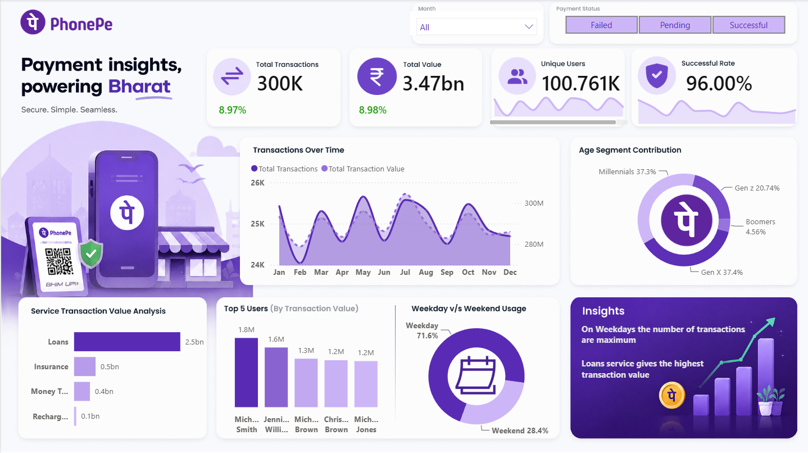

# PhonePe Transaction Analytics Dashboard | Power BI

## Project Overview

This project is an interactive Power BI dashboard built to analyze PhonePe transaction data across different states, years, and transaction categories. The dashboard provides insights into transaction volume, transaction value, success rates, and growth trends through dynamic and user-friendly visualizations.

## Dashboard Features

- Interactive KPI Cards for Total Transactions and Transaction Value
- Month-over-Month (MoM) Growth Analysis using DAX
- State-wise and Regional Transaction Analysis
- Dynamic Slicers for Year and Month selection
- Dynamic Text Titles that automatically update based on user selections
- Dynamic Conditional Formatting and Color Changes
- Custom Tooltips for detailed transaction insights
- Interactive Cross-Filtering between visuals
- Trend Analysis using Line Charts and Area Charts
- Drill-Down Analysis for deeper business insights

## Key Power BI Skills Demonstrated

### Data Modeling
- Created relationships between fact and dimension tables
- Implemented a star-schema-based model for efficient reporting

### DAX Measures
- Total Transactions
- Total Transaction Value
- Successful Transactions
- Previous Month Metrics
- Month-over-Month Growth %
- Dynamic Titles and KPI Calculations

### Power Query
- Data Cleaning
- Data Transformation
- Data Type Management
- Handling Missing Values

### Interactive Features
- Dynamic Slicers
- Dynamic Text
- Dynamic Coloring
- Report Tooltips
- Cross Filtering
- Responsive Dashboard Design

## Business Insights

- Identified transaction trends across different time periods.
- Compared transaction performance across states and regions.
- Monitored growth and performance using dynamic KPIs.
- Enabled decision-making through interactive data exploration.

## Tools & Technologies

- Power BI
- DAX
- Power Query
- Data Modeling
- Excel
- Data Visualization

## Dashboard Preview



## Repository Structure

```text
PhonePe-Dashboard-PowerBI/
│
├── PhonePay_Analysis.pbix
├── PhonePe_Dashboard.png
└── README.md
